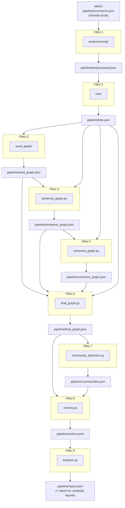

# Arquitetura — Pipe and Filter

O **GameReviewGraph** é estruturado como um pipeline de **Pipe and Filter**: cada módulo é um filtro independente que lê uma entrada bem definida, aplica uma transformação e escreve uma saída serializada. Os filtros se comunicam exclusivamente por artefatos JSON armazenados no **MinIO S3** — nenhum filtro importa diretamente funções internas de outro. Resultados intermediários são mantidos no **Redis** para evitar reprocessamento.

---

## Pipeline Completo



> Todos os artefatos intermediários residem no bucket `game-review-graph` do MinIO sob o prefixo `pipeline/`. O Redis mantém os resultados em cache com a chave `filter:<nome>` — em um cache hit, `AbstractFilter.execute()` pula `process()` e regrava o artefato no S3 sem reprocessar.

---

## Tabela de Filtros

| # | Filtro | Entradas (S3) | Saída (S3) | Responsabilidade |
|---|--------|---------------|------------|-----------------|
| 1 | `preprocessing/` | `comments.json` | `preprocessed.json` | Lowercase, remoção de pontuação, segmentação e tokenização por regex, stopwords PT (NLTK), normalização A1' (radical RSLP como chave de agrupamento; emite a forma de superfície mais frequente do grupo, com acento) |
| 2 | `tree/` | `preprocessed.json` | `tree.json` | Constrói a Árvore N-ária: Dataset → Comentário → Frase → Palavra |
| 3 | `word_graph/` | `tree.json` | `word_graph.json` | Grafo de co-ocorrência de palavras com peso posicional |
| 4 | `sentence_graph.py` | `word_graph.json` + `tree.json` | `sentence_graph.json` | Grafo de frases derivado das relações entre palavras |
| 5 | `comment_graph.py` | `sentence_graph.json` + `tree.json` | `comment_graph.json` | Grafo de comentários derivado das relações entre frases |
| 6 | `final_graph.py` | `word_graph.json` + `sentence_graph.json` + `comment_graph.json` + `tree.json` | `final_graph.json` | Grafo unificado: 3 níveis + arestas hierárquicas da árvore |
| 7 | `community_detection.py` | `final_graph.json` | `communities.json` | MST (Prim) + corte progressivo de arestas + BFS/DFS → K=10 comunidades |
| 8 | `metrics.py` | `final_graph.json` + `communities.json` | `metrics.json` | Centralidade de grau ponderada + Modularidade Q |
| 9 | `analysis.py` | `metrics.json` | `report.json` (+ `report.txt`) | Relatório final estruturado: tópicos, termos centrais, comentários, Q e comparação de 3 métodos de detecção. Renderizado também na última página do frontend. `report.txt` é projeção legível |

---

## Contratos de Interface (Tipos Python)

Cada filtro concreto herda `AbstractFilter` e implementa apenas `process()`. O `main.py` instancia os filtros e os encadeia via `FilterChain` — o I/O com MinIO e o cache Redis são gerenciados automaticamente por `AbstractFilter.execute()`.

| Filtro | Tipo de entrada (`process`) | Tipo de saída (`process`) |
|--------|-----------------------------|--------------------------|
| `preprocessing/` | `list[RawComment]` | `list[ProcessedComment]` |
| `tree/` | `list[ProcessedComment]` | `NaryTree` |
| `word_graph/` | `dict` (tree.json) | `Graph` |
| `sentence_graph.py` | `Graph` (word) + `NaryTree` | `Graph` |
| `comment_graph.py` | `Graph` (sentence) + `NaryTree` | `Graph` |
| `final_graph.py` | `Graph` × 3 + `NaryTree` | `Graph` |
| `community_detection.py` | `Graph` | `Communities` |
| `metrics.py` | `Graph` + `Communities` | `Metrics` |
| `analysis.py` | `Metrics` | `dict` (`report.json`; `report.txt` é projeção) |

**Tipos** (pacote `src/types/`, um módulo por grupo semântico — ver [`grafos.md`](grafos.md) para o detalhe de `Graph`):

```python
RawComment       = dict                                          # {"id": int, "topic": str, "text": str}
ProcessedComment = dict                                          # {"id": int, "sentences": list[list[str]]}  (sem "topic": rótulo-ouro fica só no raw)
NodeKey          = str                                           # "w_word", "s_12", "c_3"
Graph            = dataclass(nodes, index, matrix)                # matriz de adjacência + mapeamento nome→índice
Communities      = dict[int, list[str]]                          # community_id → [node_key, ...]
Metrics          = dict                                          # ver schema em metrics.py
```

Sempre importar de `src.types` (o pacote), nunca de um submódulo (`src.types.graph`, etc.).

---

## Estrutura de Artefatos (MinIO)

Todos os artefatos vivem no bucket `game-review-graph` sob o prefixo `pipeline/`. O mapeamento entre chave lógica e objeto S3 é definido em `src/config.py` (`S3_KEYS`):

```
s3://game-review-graph/
└── pipeline/
    ├── comments.json           # entrada bruta — carregada via make init-data
    ├── preprocessed.json       # saída do Filtro 1
    ├── tree.json               # saída do Filtro 2
    ├── word_graph.json         # saída do Filtro 3
    ├── sentence_graph.json     # saída do Filtro 4
    ├── comment_graph.json      # saída do Filtro 5
    ├── final_graph.json        # saída do Filtro 6
    ├── communities.json        # saída do Filtro 7
    ├── metrics.json            # saída do Filtro 8
    ├── report.json             # saída do Filtro 9 (estruturada; consumida pelo frontend)
    └── report.txt              # projeção legível do report.json
```

**Cache Redis:** cada filtro armazena seu resultado serializado com pickle sob a chave `filter:<nome>` (ex.: `filter:word_graph`). `make clean` apaga todas as chaves `filter:*` e os artefatos S3 (exceto `comments.json`).

---

## Decisões de Design

| Decisão | Escolha | Justificativa |
|---------|---------|---------------|
| Comunicação entre filtros | Artefatos JSON no MinIO S3 | Permite executar qualquer filtro isoladamente; artefatos são inspecionáveis via console MinIO (`localhost:9001`) |
| Cache de resultados | Redis com pickle | Evita reprocessamento em execuções parciais; `make clean` invalida o cache sem destruir os artefatos S3 |
| Execução isolada | `make <filtro>` via `docker compose run` | Debug por etapa sem reprocessar o pipeline inteiro |
| Prefixos de nó (`w_`, `s_`, `c_`) | Convenção no `final_graph.json` | Identifica o tipo de um nó sem tabela auxiliar; evita colisão de chaves entre os três níveis |
| Infraestrutura de padrões GoF | `src/shared/` isolado dos filtros de domínio | Filtros de domínio não importam uns dos outros; `shared/` é a única dependência cruzada permitida |
| Padrões GoF aplicados | Template Method, Chain of Responsibility, Facade, Observer, Strategy | Ver [Padrões de Projeto](padroes_projeto.md) para especificação completa |
| Execução containerizada | Docker obrigatório | Garante paridade entre dev, CI e entrega; elimina "funciona na minha máquina" |
| S3 local em dev | MinIO | API 100% compatível com AWS S3; zero custo; console visual para inspeção |
| Sem bibliotecas de grafos | Regra da disciplina | Penalidade de −5,0 pontos em caso de violação |
| K = 10 comunidades | Constante global em `src/config.py` | Facilita ajuste sem alterar código dos filtros |

---

## Histórico de Revisão

| Data | Versão | Descrição | Autor |
|------|--------|-----------|-------|
| 12/06/2026 | 1.0 | Criação inicial do documento | Lucas Antunes |
| 12/06/2026 | 2.0 | Migração para MinIO S3 + Redis; atualização do diagrama, tabela de filtros e estrutura de artefatos | Lucas Antunes |
| 16/06/2026 | 2.1 | Filtro 1 vira pacote `preprocessing/`; descrição reflete normalização A1' (radical RSLP como chave; emite forma de superfície com acento) | Lucas Antunes |
| 16/06/2026 | 2.2 | `ProcessedComment` sem `topic` (rótulo-ouro reservado à validação por `id`) | Equipe |
| 17/06/2026 | 2.3 | Filtro 2 vira pacote `tree/` (modelo do Filtro 1: `filter.py`, `structure.py`, `build.py`, `serialize.py`); leitura de `tree.json` em `src/shared/tree.py` | Lucas Antunes |
| 17/06/2026 | 2.4 | Filtro 3 vira pacote `word_graph/` (`filter.py`, `cooccurrence.py`); entrada do `process` é o dict do `tree.json` | Lucas Antunes |
| 22/06/2026 | 2.5 | Filtro 9 gera `report.json` estruturado (+ `report.txt` como projeção) com comparação de 3 métodos de detecção; saída renderizada na última página do frontend | Lucas Antunes |
