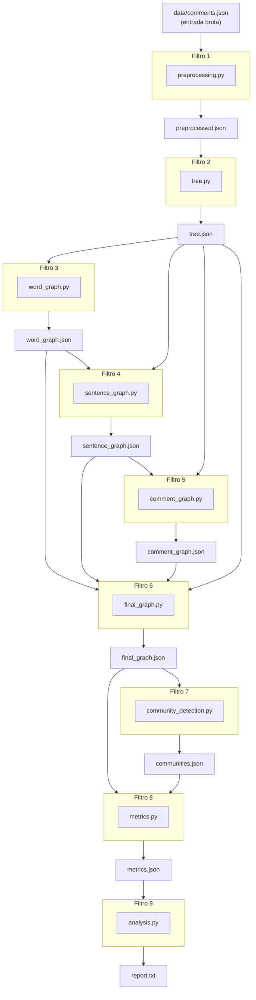

# Arquitetura — Pipe and Filter

O **GameReviewGraph** é estruturado como um pipeline de **Pipe and Filter**: cada módulo é um filtro independente que lê uma entrada bem definida, aplica uma transformação e escreve uma saída serializada. Os filtros se comunicam exclusivamente por arquivos intermediários — nenhum filtro importa diretamente funções internas de outro.

---

## Pipeline Completo



---

## Tabela de Filtros

| # | Filtro | Entradas | Saída | Responsabilidade |
|---|--------|----------|-------|-----------------|
| 1 | `preprocessing.py` | `comments.json` | `preprocessed.json` | Lowercase, remoção de pontuação, tokenização, stopwords, stemming/lematização |
| 2 | `tree.py` | `preprocessed.json` | `tree.json` | Constrói a Árvore N-ária: Dataset → Comentário → Frase → Palavra |
| 3 | `word_graph.py` | `tree.json` | `word_graph.json` | Grafo de co-ocorrência de palavras com peso posicional |
| 4 | `sentence_graph.py` | `word_graph.json` + `tree.json` | `sentence_graph.json` | Grafo de frases derivado das relações entre palavras |
| 5 | `comment_graph.py` | `sentence_graph.json` + `tree.json` | `comment_graph.json` | Grafo de comentários derivado das relações entre frases |
| 6 | `final_graph.py` | `word_graph.json` + `sentence_graph.json` + `comment_graph.json` + `tree.json` | `final_graph.json` | Grafo unificado: 3 níveis + arestas hierárquicas da árvore |
| 7 | `community_detection.py` | `final_graph.json` | `communities.json` | Corte progressivo de arestas + BFS/DFS → K=10 comunidades |
| 8 | `metrics.py` | `final_graph.json` + `communities.json` | `metrics.json` | Centralidade de grau ponderada + Modularidade Q |
| 9 | `analysis.py` | `metrics.json` | `report.txt` + stdout | Geração do relatório final com tópicos e métricas |

---

## Contratos de Interface (Tipos Python)

Cada filtro expõe uma função principal com assinatura tipada. O `main.py` chama os filtros em sequência, passando objetos Python em memória (o I/O em disco é para persistência e execução isolada).

| Filtro | Tipo de entrada (Python) | Tipo de saída (Python) |
|--------|--------------------------|------------------------|
| `preprocessing.py` | `list[RawComment]` | `list[ProcessedComment]` |
| `tree.py` | `list[ProcessedComment]` | `NaryTree` |
| `word_graph.py` | `NaryTree` | `Graph` |
| `sentence_graph.py` | `Graph` (word) + `NaryTree` | `Graph` |
| `comment_graph.py` | `Graph` (sentence) + `NaryTree` | `Graph` |
| `final_graph.py` | `Graph` × 3 + `NaryTree` | `Graph` |
| `community_detection.py` | `Graph` | `Communities` |
| `metrics.py` | `Graph` + `Communities` | `Metrics` |
| `analysis.py` | `Metrics` | `str` (relatório) |

**Aliases de tipo** (definidos em `src/types.py`):

```python
# tipos canônicos do projeto
RawComment      = dict                            # {"id": int, "topic": str, "text": str}
ProcessedComment = dict                           # {"id": int, "topic": str, "sentences": list[list[str]]}
Graph           = dict[str, dict[str, float]]     # adjacency list; keys prefixed w_, s_, c_
Communities     = dict[int, list[str]]            # community_id → [node_key, ...]
Metrics         = dict                            # ver schema em metrics.py
```

---

## Estrutura de Arquivos em Disco

```
data/
├── comments.json           # entrada bruta — NUNCA modificar
├── preprocessed.json       # saída do Filtro 1
├── tree.json               # saída do Filtro 2
├── word_graph.json         # saída do Filtro 3
├── sentence_graph.json     # saída do Filtro 4
├── comment_graph.json      # saída do Filtro 5
├── final_graph.json        # saída do Filtro 6
├── communities.json        # saída do Filtro 7
├── metrics.json            # saída do Filtro 8
├── report.txt              # saída do Filtro 9 (legível por humanos)
└── cache/
    ├── preprocessed.pkl    # cache pickle (opcional, aceleração)
    ├── tree.pkl
    ├── word_graph.pkl
    ├── sentence_graph.pkl
    ├── comment_graph.pkl
    ├── final_graph.pkl
    ├── communities.pkl
    └── metrics.pkl
```

**Regra de cache:** cada filtro verifica `data/cache/<nome>.pkl` antes de processar. Se existir e o JSON de entrada não tiver sido modificado (por mtime), carrega o pickle. Caso contrário, processa e salva ambos (JSON + pickle).

---

## Decisões de Design

| Decisão | Escolha | Justificativa |
|---------|---------|---------------|
| Comunicação entre filtros | Arquivos intermediários (JSON oficial + pickle opcional) | Permite executar qualquer filtro de forma isolada sem reprocessar o pipeline inteiro; JSON é versionável e legível para inspeção manual |
| Execução isolada | Cada módulo tem bloco `if __name__ == "__main__"` | Facilita debug por etapa durante o desenvolvimento em ondas |
| Prefixos de nó (`w_`, `s_`, `c_`) | Convenção no `final_graph.json` | Permite identificar o tipo de um nó sem tabela auxiliar; evita colisão de chaves entre os três níveis |
| Organização do código | Tudo em `src/` | Separa código de `docs/`, `data/` e arquivos de configuração na raiz |
| Sem bibliotecas de grafos | Regra da disciplina | Penalidade de −5,0 pontos em caso de violação |
| K = 10 comunidades | Constante global em `src/config.py` | Facilita ajuste sem alterar código dos filtros |

---

## Histórico de Revisão

| Data | Versão | Descrição | Autor |
|------|--------|-----------|-------|
| 12/06/2026 | 1.0 | Criação inicial do documento | Lucas Antunes |
