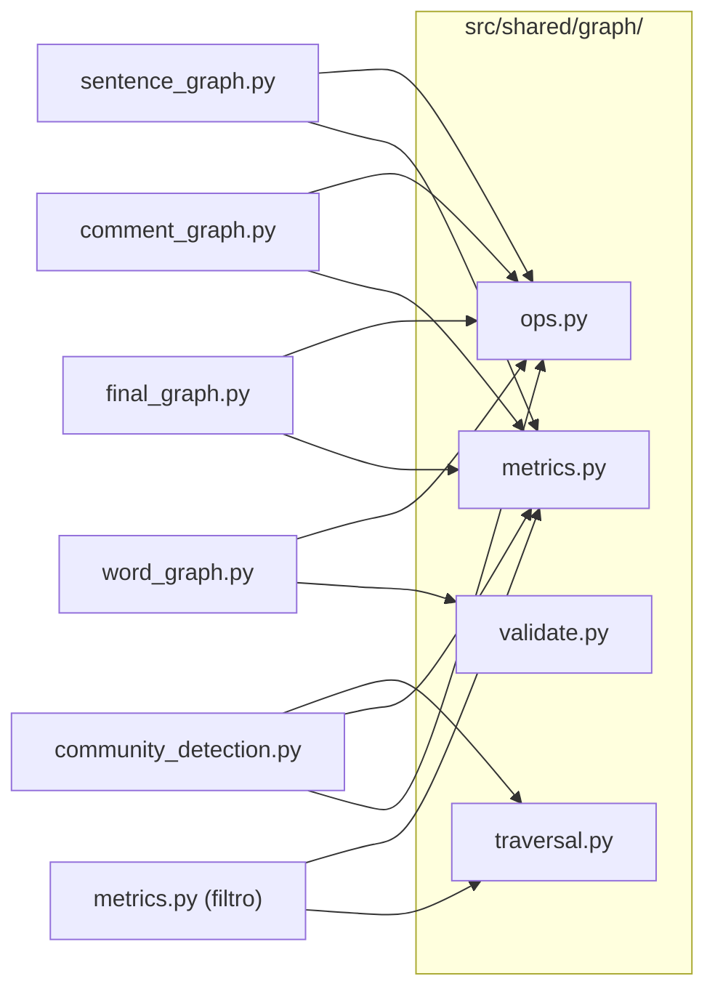

# Utilitários de Grafos

O sub-pacote `src/shared/graph/` fornece as operações primitivas sobre grafos compartilhadas por todos os filtros de construção e análise do pipeline. É uma camada utilitária pura sobre a representação canônica do projeto, definida em `src/types/graph.py`:

```python
@dataclass
class Graph:
    nodes: list[str]            # índice -> nome do nó (w_, s_, c_)
    index: dict[str, int]       # nome do nó -> índice (mapeamento)
    matrix: list[list[float]]   # matriz de adjacência; matrix[i][j] == 0.0 significa "sem aresta"
```

A matriz é sempre completa/simétrica (`matrix[i][j] == matrix[j][i]`) e cresce um nó por vez: ao registrar um nome ainda não visto, uma coluna `0.0` é adicionada a cada linha existente e uma nova linha cheia de `0.0` é adicionada à matriz. Não há pré-alocação de capacidade — como a estrutura já é O(n²) no tamanho final, crescer incrementalmente custa, no total, o mesmo que alocar tudo de uma vez. `0.0` é uma sentinela segura para "sem aresta" porque todas as fórmulas de peso do projeto produzem valores estritamente positivos.

Nenhum filtro re-implementa operações básicas de grafo. Toda lógica de travessia, consulta e validação vive aqui e é importada via a API pública do sub-pacote.

---

## Estrutura

```
src/shared/graph/
├── __init__.py     ← API pública: re-exports seletivos de todos os módulos
├── ops.py          ← CRUD: criação, atualização e remoção de arestas
├── metrics.py      ← propriedades: grau, densidade, contagens
├── traversal.py    ← travessias: BFS, DFS, componentes conectados
└── validate.py     ← validação estrutural: simetria, prefixos, nós isolados
```

**Regra de importação:** filtros importam sempre do sub-pacote raiz, nunca dos módulos internos.

```python
# CORRETO
from src.shared.graph import add_edge, increase_edge, degree, connected_components

# ERRADO — expõe estrutura interna
from src.shared.graph.ops import increase_edge
```

---

## Consumidores por filtro



---

## `ops.py` — Operações CRUD

### Funções

| Função | Descrição |
|--------|-----------|
| `new_graph()` | Retorna um `Graph` vazio (sem nós, matriz vazia) |
| `add_node(graph, name)` | Retorna o índice de `name`, criando-o (e crescendo a matriz) se ausente; idempotente |
| `add_edge(graph, u, v, weight)` | Cria os nós ausentes e sobrescreve a aresta `(u, v)` com o peso dado |
| `increase_edge(graph, u, v, delta)` | Cria os nós ausentes e acrescenta `delta` ao peso de `(u, v)`; cria a aresta se não existir |
| `remove_edge(graph, u, v)` | Zera a célula `(u, v)` nas duas direções; não-op se algum nó ou a aresta não existir |
| `has_edge(graph, u, v)` | Retorna `True` se a aresta existe (`matrix[i][j] != 0.0`) |
| `get_edge_weight(graph, u, v)` | Retorna o peso da aresta ou `None` |
| `iter_edges(graph)` | Percorre o triângulo superior da matriz (`j > i`), retornando cada aresta exatamente uma vez como `(u, v, weight)` |
| `copy_graph(graph)` | Retorna uma cópia profunda: nova lista de nós, novo dict de índices e matriz com cada linha copiada |

`add_node` e `new_graph` são as únicas funções que alteram `graph.nodes`/`graph.index`/crescem `graph.matrix`. Toda outra operação de escrita chama `add_node` internamente para resolver nomes em índices — nenhuma função indexa a matriz diretamente com um nome bruto.

### `add_edge` vs `increase_edge`

A distinção entre as duas operações de escrita é central para o modelo de grafos do projeto:

| Situação | Operação correta |
|----------|-----------------|
| Definir um peso calculado externamente | `add_edge` |
| Registrar uma nova co-ocorrência de par `(u, v)` | `increase_edge` |

Os três grafos de co-ocorrência usam **exclusivamente** `increase_edge`: o peso de uma aresta é a soma das contribuições de todas as co-ocorrências do par ao longo do corpus.

### Exemplos por nível de grafo

**`word_graph.py`** — contribuição posicional a cada co-ocorrência de `wi` e `wj`:

```python
delta = 1.0 / (1.0 + abs(pos_i - pos_j))
increase_edge(graph, f"w_{wi}", f"w_{wj}", delta)
```

**`sentence_graph.py`** — acumulação das contribuições de pares de palavras antes da normalização:

```python
# acumula: weight(sa, sb) += weight(wi, wj)  para wi ∈ sa, wj ∈ sb
increase_edge(graph, f"s_{a}", f"s_{b}", get_edge_weight(word_graph, f"w_{wi}", f"w_{wj}"))

# depois normaliza pelo produto dos tamanhos das sentenças
for u, v, w in iter_edges(graph):
    add_edge(graph, u, v, w / (len_sa[u] * len_sb[v]))
```

**`comment_graph.py`** — mesmo padrão usando pesos de pares de sentenças.

---

## `metrics.py` — Propriedades do Grafo

### Funções

| Função | Descrição |
|--------|-----------|
| `degree(graph, node)` | Número de vizinhos do nó (grau não-ponderado) |
| `weighted_degree(graph, node)` | Soma dos pesos das arestas incidentes ao nó |
| `node_count(graph)` | Total de nós no grafo |
| `edge_count(graph)` | Total de arestas não-direcionadas únicas |
| `density(graph)` | Razão entre arestas existentes e máximo possível |
| `average_weight(graph)` | Média dos pesos de todas as arestas únicas |

`degree`/`weighted_degree` resolvem `node` para um índice via `graph.index[node]` e percorrem a linha correspondente de `graph.matrix` contando/somando entradas `!= 0.0`. `node_count` é `len(graph.nodes)`; `edge_count` e `average_weight` reaproveitam `iter_edges`.

### Uso em destaque

**`community_detection.py`** — condição de remoção de aresta:

```python
if degree(graph, u) > 1 and degree(graph, v) > 1:
    remove_edge(graph, u, v)
```

**`metrics.py` (Filtro 8)** — centralidade de grau ponderada:

```python
total = sum(weighted_degree(graph, n) for n in graph.nodes)
centrality[node] = weighted_degree(graph, node) / total
```

---

## `traversal.py` — Travessias

### Funções

| Função | Descrição |
|--------|-----------|
| `bfs(graph, start)` | Retorna nós alcançáveis a partir de `start` em ordem BFS |
| `dfs(graph, start)` | Retorna nós alcançáveis a partir de `start` em ordem DFS |
| `reachable(graph, start)` | Conjunto de todos os nós alcançáveis a partir de `start` |
| `connected_components(graph)` | Lista de componentes conectados (cada componente é uma lista de nós) |
| `count_components(graph)` | Número de componentes conectados |
| `is_connected(graph)` | `True` se o grafo tem exatamente um componente |
| `minimum_spanning_tree(graph)` | Retorna um novo `Graph` com a Árvore Geradora Mínima de `graph`, construída via Prim (versão densa/array, O(V²), sem fila de prioridade) |

Todos os algoritmos são implementados do zero — sem bibliotecas de grafo externas. Na API pública, `start` e os nós retornados continuam sendo **nomes** (`str`); internamente, `start` é resolvido para um índice, os vizinhos são obtidos varrendo a linha correspondente de `graph.matrix` por entradas `!= 0.0`, e os índices são traduzidos de volta para nomes via `graph.nodes[i]` antes de retornar. `bfs` usa `collections.deque`; `dfs` usa pilha explícita (sem recursão).

`minimum_spanning_tree` foi escolhido com Prim (e não Kruskal) porque os grafos do projeto são densos e já estão representados como matriz de adjacência: Prim denso roda em O(V²) sem nenhuma estrutura auxiliar, enquanto Kruskal exigiria extrair e ordenar todas as arestas (O(E log E), ≈ O(V² log V) em grafo denso) mais uma estrutura Union-Find. `minimum_spanning_tree` não muta `graph` e é usada por `ProgressiveEdgeCuttingStrategy` (`strategies.py`) para reduzir o grafo final a V−1 arestas antes do corte progressivo.

### Centralização do BFS/DFS

Antes desta camada, `ProgressiveEdgeCuttingStrategy` em `strategies.py` mantinha implementações privadas de BFS (`_bfs`, `_bfs_collect`, `_count_components`, `_label_components`). Essas implementações foram removidas e substituídas pelas funções centralizadas:

```python
# strategies.py — antes
components = self._count_components(working)

# strategies.py — depois
from src.shared.graph import count_components, connected_components
components = count_components(working)
```

---

## `validate.py` — Validação Estrutural

### Funções

| Função | Descrição |
|--------|-----------|
| `is_symmetric(graph)` | `True` se `matrix[i][j] == matrix[j][i]` para todo `i, j` |
| `invalid_prefixes(graph, allowed=("w_", "s_", "c_"))` | Lista de nós com prefixo inválido |
| `isolated_nodes(graph)` | Lista de nós com grau zero |
| `assert_valid(graph)` | Levanta `ValueError` se o grafo falha em qualquer invariante estrutural (simetria, prefixos, `matrix[i][i] == 0.0` para todo `i`) |

`invalid_prefixes` e `isolated_nodes` percorrem `graph.nodes` (e usam `degree`/`graph.index` no segundo caso). `is_symmetric` e a checagem de self-loop em `assert_valid` percorrem `graph.matrix` diretamente.

### Quando usar `assert_valid`

Chame no final do `process()` de cada filtro durante o desenvolvimento e nos testes unitários. A chamada pode ser removida em produção se o profiling indicar gargalo — mas deve ser mantida nos testes.

```python
# ao final de process() em word_graph.py, sentence_graph.py, etc.
assert_valid(graph)
return graph
```

---

## O que não pertence aqui

| Funcionalidade | Onde fica |
|----------------|-----------|
| `merge_graphs` | Método privado de `final_graph.py` — usado exclusivamente por ele |
| Fórmulas de peso (`1 / (1 + \|pos_i - pos_j\|)`) | Dentro do `process()` de cada filtro |
| Algoritmo de corte progressivo de arestas | `src/shared/strategies.py` |
| Modularidade Q | `metrics.py` (Filtro 8) |

---

## Histórico de Revisão

| Data | Versão | Descrição | Autor |
|------|--------|-----------|-------|
| 12/06/2026 | 1.0 | Criação do documento | Lucas Antunes |
| 16/06/2026 | 2.0 | Representação trocada de dict de adjacências para matriz de adjacência + mapeamento nome→índice (`Graph` dataclass em `src/types.py`); adicionadas `new_graph` e `add_node` | Lucas Antunes |
| 16/06/2026 | 2.1 | `src/types.py` transformado em pacote `src/types/`, dividido por semântica (`comments.py`, `graph.py`, `communities.py`, `metrics.py`) | Lucas Antunes |
| 16/06/2026 | 2.2 | Adicionada `minimum_spanning_tree` (Prim, denso) em `traversal.py`; `ProgressiveEdgeCuttingStrategy` agora constrói a MST antes do corte progressivo | Lucas Antunes |
