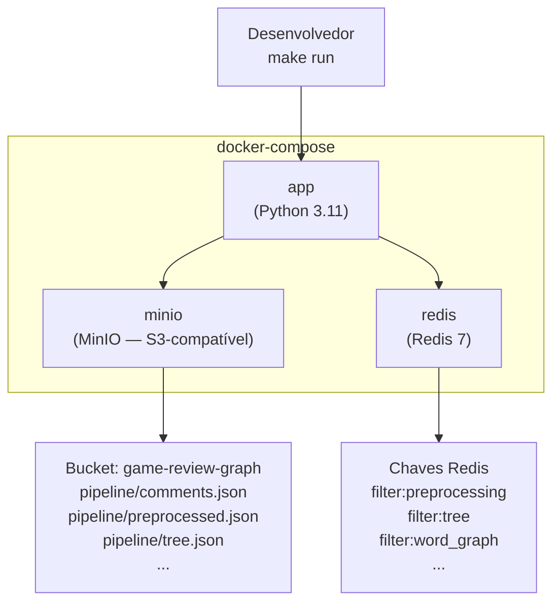

# Infraestrutura

O **GameReviewGraph** é executado inteiramente via Docker. A orquestração combina três serviços: a aplicação Python, um armazenamento S3-compatível (MinIO) para os artefatos do pipeline, e um cache Redis para os resultados dos filtros.

---

## Visão Geral



---

## Serviços

| Serviço | Imagem | Porta local | Papel |
|---------|--------|-------------|-------|
| `app` | build local (`Dockerfile`) | — | Executa os 9 filtros do pipeline |
| `minio` | `minio/minio:latest` | `9000` (API), `9001` (console) | Armazena artefatos JSON e `report.txt` |
| `redis` | `redis:7-alpine` | `6379` | Cache pickle dos resultados dos filtros |

---

## S3 — Estrutura do Bucket

O bucket `game-review-graph` contém todos os artefatos do pipeline sob o prefixo `pipeline/`:

| Chave S3 | Equivalente anterior | Filtro que grava |
|----------|---------------------|-----------------|
| `pipeline/comments.json` | `data/comments.json` | entrada bruta (upload via `make init-data`) |
| `pipeline/preprocessed.json` | `data/preprocessed.json` | Filtro 1 |
| `pipeline/tree.json` | `data/tree.json` | Filtro 2 |
| `pipeline/word_graph.json` | `data/word_graph.json` | Filtro 3 |
| `pipeline/sentence_graph.json` | `data/sentence_graph.json` | Filtro 4 |
| `pipeline/comment_graph.json` | `data/comment_graph.json` | Filtro 5 |
| `pipeline/final_graph.json` | `data/final_graph.json` | Filtro 6 |
| `pipeline/communities.json` | `data/communities.json` | Filtro 7 |
| `pipeline/metrics.json` | `data/metrics.json` | Filtro 8 |
| `pipeline/report.txt` | `data/report.txt` | Filtro 9 |

O bucket é criado automaticamente na primeira execução se não existir.

---

## Redis — Convenção de Chaves

Cada filtro armazena seu resultado serializado em pickle com a chave `filter:<nome>`:

| Chave Redis | Filtro |
|-------------|--------|
| `filter:preprocessing` | Filtro 1 |
| `filter:tree` | Filtro 2 |
| `filter:word_graph` | Filtro 3 |
| `filter:sentence_graph` | Filtro 4 |
| `filter:comment_graph` | Filtro 5 |
| `filter:final_graph` | Filtro 6 |
| `filter:community_detection` | Filtro 7 |
| `filter:metrics` | Filtro 8 |
| `filter:analysis` | Filtro 9 |

Em um cache hit, `AbstractFilter.execute()` pula `process()` e retorna o resultado em Redis diretamente para S3 sem reprocessar.

---

## Variáveis de Ambiente

Todas as variáveis são lidas pelo `src/config.py` via `os.environ`. Copie `.env.example` para `.env` e ajuste os valores:

```bash
cp .env.example .env
```

| Variável | Padrão | Descrição |
|----------|--------|-----------|
| `S3_BUCKET` | `game-review-graph` | Nome do bucket MinIO/S3 |
| `S3_ENDPOINT_URL` | `http://minio:9000` | URL da API S3 (MinIO em dev) |
| `AWS_ACCESS_KEY_ID` | `minioadmin` | Usuário MinIO (ou chave AWS em prod) |
| `AWS_SECRET_ACCESS_KEY` | `minioadmin` | Senha MinIO (ou segredo AWS em prod) |
| `MINIO_ROOT_USER` | `minioadmin` | Usuário root do container MinIO |
| `MINIO_ROOT_PASSWORD` | `minioadmin` | Senha root do container MinIO |
| `REDIS_URL` | `redis://redis:6379/0` | URL de conexão com Redis |

---

## Executando Localmente

### Pré-requisitos

- Docker Engine 24+
- Docker Compose v2 (`docker compose` sem hífen)

### Primeira vez

```bash
# 1. Copie as variáveis de ambiente
cp .env.example .env

# 2. Suba os serviços em background
make docker-up

# 3. Faça upload do arquivo de entrada bruta para MinIO
make init-data

# 4. Execute o pipeline completo
make run
```

### Execuções subsequentes

```bash
# Infraestrutura
make docker-status           # ver containers e estado de saúde
make docker-logs             # acompanhar logs em tempo real
make docker-down             # parar todos os containers
make docker-restart          # rebuild + restart completo

# Pipeline
make run                     # pipeline completo
make preprocessing           # filtro 1 isolado
make word-graph              # filtro 3 isolado
make clean                   # apaga cache Redis + artefatos S3 (preserva comments.json)
```

### Console MinIO (inspeção visual)

Acesse `http://localhost:9001` com usuário `minioadmin` / senha `minioadmin` para inspecionar os artefatos no bucket.

---

## CI/CD — GitHub Actions

O pipeline de CI usa `docker-compose.ci.yml` sobreposto ao `docker-compose.yml`. As diferenças:

- Serviços `minio` e `redis` expõem **health checks** — o `app` só inicia após ambos estarem saudáveis
- Nenhuma porta é exposta ao host (sem conflito em runners compartilhados)
- Credenciais via GitHub Secrets: `S3_BUCKET`, `AWS_ACCESS_KEY_ID`, `AWS_SECRET_ACCESS_KEY`, `REDIS_URL`

**Workflow de CI (`.github/workflows/ci.yml`):**

```yaml
- name: Subir serviços
  run: docker compose -f docker-compose.yml -f docker-compose.ci.yml up -d minio redis

- name: Aguardar serviços saudáveis
  run: docker compose -f docker-compose.yml -f docker-compose.ci.yml up --wait minio redis

- name: Upload dados de entrada
  run: docker compose -f docker-compose.yml -f docker-compose.ci.yml run --rm app uv run python scripts/init_data.py

- name: Executar testes
  run: docker compose -f docker-compose.yml -f docker-compose.ci.yml run --rm app uv run pytest
```

---

## Arquitetura de Camadas (`src/shared/`)

A infraestrutura de armazenamento e cache é implementada em dois módulos de `src/shared/`:

| Módulo | Padrão GoF relacionado | Papel |
|--------|----------------------|-------|
| `storage.py` | — (adaptador de I/O) | Leitura e escrita de artefatos no MinIO via `boto3` |
| `cache.py` | — (adaptador de cache) | Armazenamento e recuperação de resultados no Redis |

`AbstractFilter` (Template Method) usa esses dois adaptadores em `execute()`. Nenhum filtro de domínio importa `storage.py` ou `cache.py` diretamente.

---

## Histórico de Revisão

| Data | Versão | Descrição | Autor |
|------|--------|-----------|-------|
| 12/06/2026 | 1.0 | Criação do documento com Docker, MinIO, Redis | Lucas Antunes |
