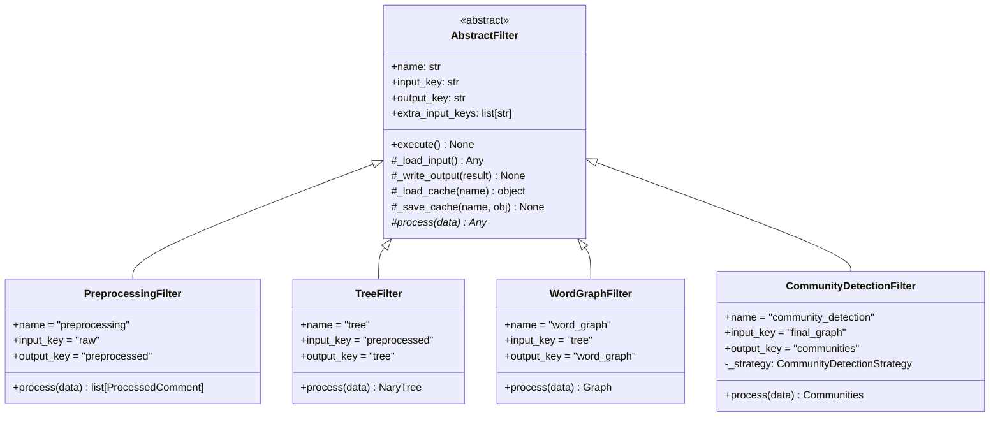
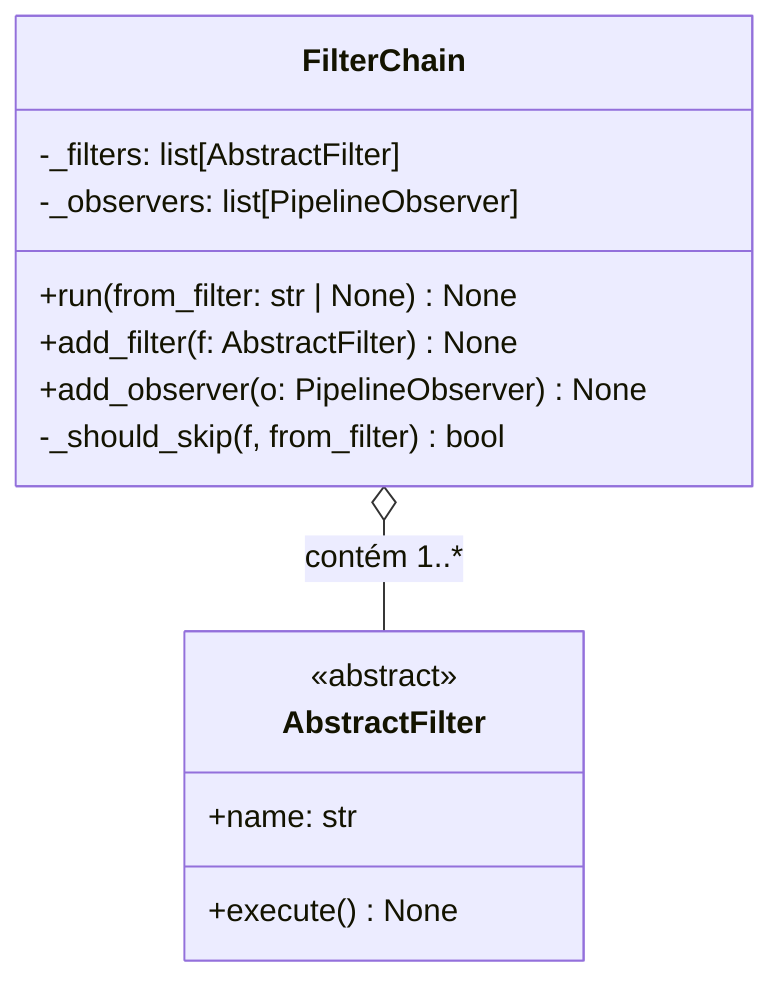
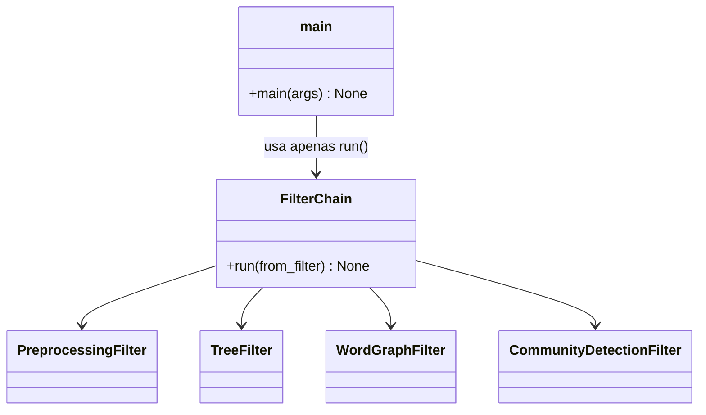
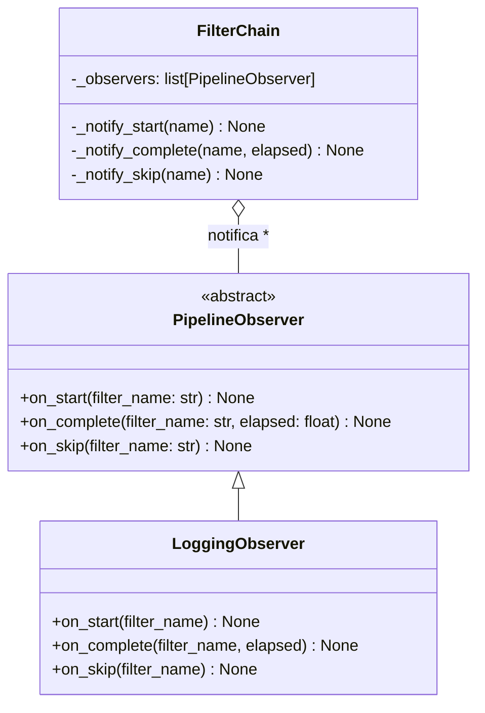
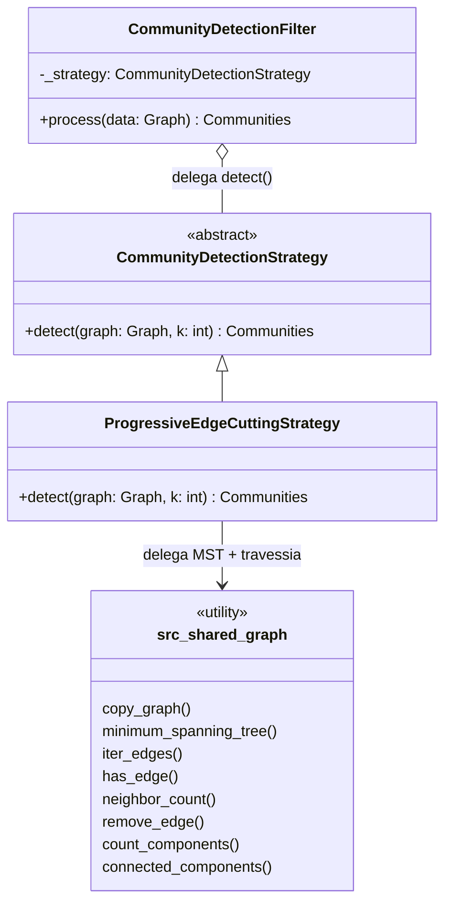

# Padrões de Projeto

O **GameReviewGraph** aplica cinco padrões GoF para formalizar o contrato entre os filtros do pipeline, centralizar o boilerplate de I/O, e permitir extensão sem modificação dos módulos existentes.

---

## Mapa de Padrões

| Padrão GoF | Categoria | Arquivo(s) | Papel no sistema |
|---|---|---|---|
| Template Method | Comportamental | `filter_base.py` | Define o esqueleto de execução de cada filtro |
| Chain of Responsibility | Comportamental | `pipeline.py` | Encadeia os filtros e gerencia o fluxo de controle |
| Facade | Estrutural | `pipeline.py` + `main.py` | Expõe interface única sobre os 9 filtros |
| Observer | Comportamental | `observers.py` | Notifica listeners sobre eventos do pipeline |
| Strategy | Comportamental | `strategies.py` | Isola o algoritmo de detecção de comunidades |

---

## Template Method — `AbstractFilter`

### Intenção

Definir o esqueleto de um algoritmo em uma operação, adiando a implementação de alguns passos para subclasses. As subclasses podem redefinir certos passos sem alterar a estrutura geral.

### Aplicação

`AbstractFilter` define `execute()` como o método-template. O fluxo é sempre: carregar entrada → transformar → salvar saída. Apenas `process()` é abstrato — cada `ConcreteFilter` implementa somente a lógica de transformação.



### Fluxo do método-template

```
AbstractFilter.execute()
    ├── _load_cache(name)         → retorna objeto cacheado ou None
    ├── [cache miss] _load_input()
    │       ├── extra_input_keys == []  → retorna primary artifact (objeto simples)
    │       └── extra_input_keys != []  → retorna {"primary": ..., "<key>": ..., ...}
    ├── process(data)             → implementado pela subclasse  ← único método abstrato
    ├── _write_output(result)     → grava em MinIO via S3_KEYS[output_key]
    └── _save_cache(name, obj)    → persiste no Redis sob filter:<name>
```

### Filtros com múltiplas entradas

Filtros que precisam de mais de um artefato declaram `extra_input_keys` e recebem um `dict` em `process()`:

```python
class SentenceGraphFilter(AbstractFilter):
    name = "sentence_graph"
    input_key = "word_graph"       # artefato primário
    extra_input_keys = ["tree"]    # artefatos secundários
    output_key = "sentence_graph"

    def process(self, data: dict) -> Graph:
        word_graph = data["primary"]
        tree = data["tree"]
        ...
```

| Filtro | `input_key` | `extra_input_keys` |
|--------|-------------|-------------------|
| `sentence_graph` | `"word_graph"` | `["tree"]` |
| `comment_graph` | `"sentence_graph"` | `["preprocessed"]` |
| `final_graph` | `"comment_graph"` | `["word_graph", "sentence_graph"]` |
| `metrics` | `"communities"` | `["final_graph"]` |

---

## Chain of Responsibility — `FilterChain`

### Intenção

Evitar acoplamento entre remetente de uma requisição e seus receptores, dando a mais de um objeto a chance de tratar a requisição. Os objetos receptores são encadeados e a requisição passa ao longo da cadeia até ser tratada.

### Aplicação

`FilterChain` mantém uma lista ordenada de `AbstractFilter`. O método `run()` percorre a cadeia em sequência. A flag `--from` permite entrar na cadeia a partir de um filtro específico, pulando os anteriores.



### Exemplo de execução com `--from`

```
FilterChain.run(from_filter="word_graph")

  [skip]  PreprocessingFilter   ← _should_skip() == True
  [skip]  TreeFilter            ← _should_skip() == True
  [exec]  WordGraphFilter       ← ponto de entrada
  [exec]  SentenceGraphFilter
  [exec]  CommentGraphFilter
  [exec]  FinalGraphFilter
  [exec]  CommunityDetectionFilter
  [exec]  MetricsFilter
  [exec]  AnalysisFilter
```

---

## Facade — `FilterChain` + `main.py`

### Intenção

Fornecer uma interface simplificada para um conjunto de interfaces em um subsistema. A Facade define uma interface de nível mais alto que facilita o uso do subsistema.

### Aplicação

`FilterChain.run()` é a Facade: o chamador em `main.py` não conhece nenhum filtro individualmente. A complexidade de instanciação, encadeamento e notificação fica encapsulada.



---

## Observer — `PipelineObserver`

### Intenção

Definir uma dependência um-para-muitos entre objetos, de modo que, quando um objeto muda de estado, todos os seus dependentes são notificados e atualizados automaticamente.

### Aplicação

`FilterChain` é o sujeito (Subject). A cada transição de estado de um filtro, notifica todos os `PipelineObserver` registrados. `LoggingObserver` é o observer concreto padrão; outros podem ser adicionados sem alterar o pipeline.



### Eventos

| Evento | Quando dispara | Dados |
|---|---|---|
| `on_start` | Antes de `filter.execute()` | `filter_name: str` |
| `on_complete` | Após `filter.execute()` com sucesso | `filter_name: str`, `elapsed: float` (segundos) |
| `on_skip` | Quando `_should_skip()` retorna `True` | `filter_name: str` |

---

## Strategy — `CommunityDetectionStrategy`

### Intenção

Definir uma família de algoritmos, encapsular cada um deles e torná-los intercambiáveis. O Strategy permite que o algoritmo varie independentemente dos clientes que o utilizam.

### Aplicação

`CommunityDetectionFilter` delega o algoritmo de corte de arestas para uma `CommunityDetectionStrategy`. A implementação padrão é `ProgressiveEdgeCuttingStrategy`, que primeiro reduz o grafo final a uma Árvore Geradora Mínima (MST, via Prim) e só então aplica o corte progressivo sobre essa árvore — mantém o corte operando sobre uma estrutura esparsa (V−1 arestas) em vez do grafo denso completo. Trocar o algoritmo não exige modificar o filtro.



`ProgressiveEdgeCuttingStrategy` não possui métodos privados de travessia nem de construção de árvore — toda lógica de MST (Prim), BFS, contagem de componentes e iteração de arestas é delegada para `src.shared.graph`. O fluxo de `detect()` passa a ser: `mst = minimum_spanning_tree(graph)` → corte progressivo sobre `mst` (mesma lógica de antes, só que a entrada já é a árvore).

---

## Estrutura de Arquivos dos Padrões

Os arquivos de infraestrutura de pipeline ficam isolados em `src/shared/`, separados dos filtros de domínio:

```
src/
├── shared/
│   ├── __init__.py
│   ├── filter_base.py   ← Template Method  (AbstractFilter)
│   ├── pipeline.py      ← Chain of Responsibility + Facade  (FilterChain)
│   ├── observers.py     ← Observer  (PipelineObserver, LoggingObserver)
│   └── strategies.py    ← Strategy  (CommunityDetectionStrategy, ProgressiveEdgeCuttingStrategy)
│
├── preprocessing/       ← ConcreteFilter 1 (pacote; filter.py herda AbstractFilter)
├── tree.py              ← ConcreteFilter 2
├── word_graph.py        ← ConcreteFilter 3
├── sentence_graph.py    ← ConcreteFilter 4
├── comment_graph.py     ← ConcreteFilter 5
├── final_graph.py       ← ConcreteFilter 6
├── community_detection.py ← ConcreteFilter 7  (usa Strategy)
├── metrics.py           ← ConcreteFilter 8
├── analysis.py          ← ConcreteFilter 9
├── config.py            ← constantes globais
├── types.py             ← type aliases
└── main.py              ← ponto de entrada
```

A separação `src/shared/` deixa claro que esses arquivos são infraestrutura reutilizável — nenhum filtro de domínio importa de outro filtro, mas todos podem importar de `src/shared/`.

### Regra de importação

```
src/shared/  →  pode ser importado por qualquer filtro
src/*.py     →  NÃO podem importar uns dos outros (regra do pipeline)
src/config.py e src/types.py  →  permitidos em qualquer lugar
```

---

## Histórico de Revisão

| Data | Versão | Descrição | Autor |
|------|--------|-----------|-------|
| 12/06/2026 | 1.0 | Criação do documento com cinco padrões GoF | Lucas Antunes |
| 12/06/2026 | 1.1 | Template Method: extra_input_keys e filtros multi-input; Strategy: delegação para src.shared.graph | Lucas Antunes |
| 16/06/2026 | 1.2 | Filtro 1 (`preprocessing/`) passa a ser pacote no diagrama de módulos | Equipe |
